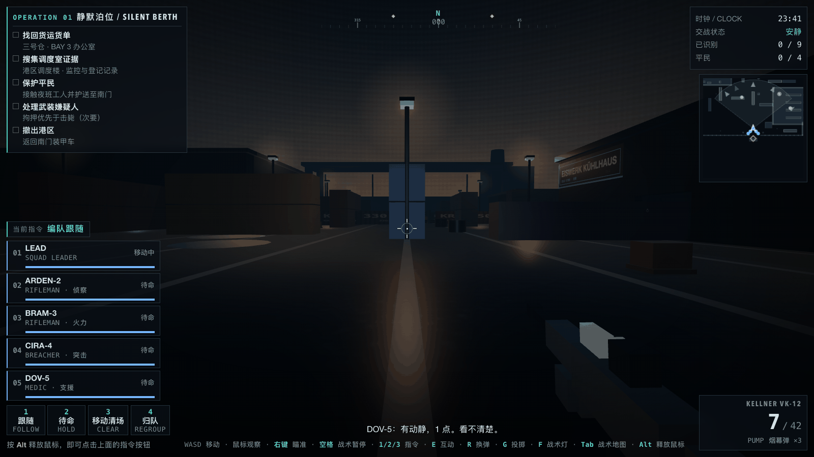
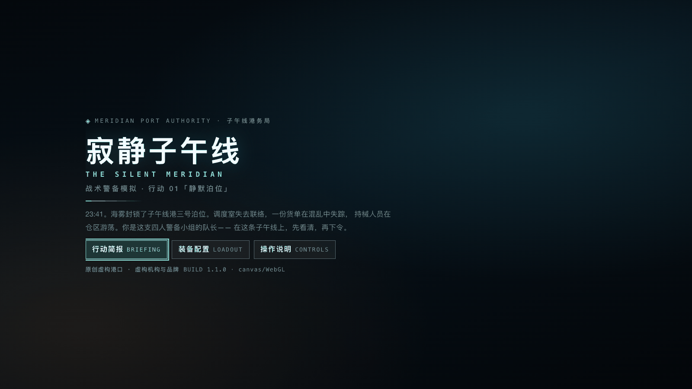
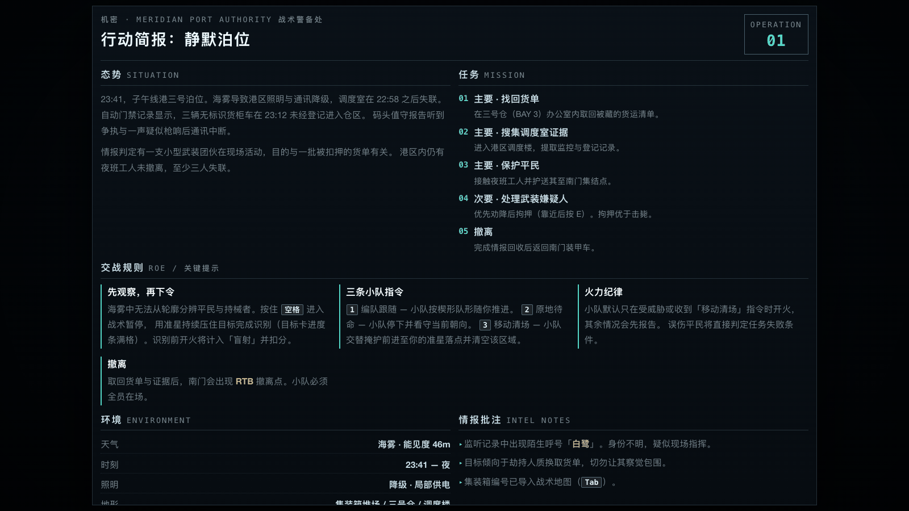
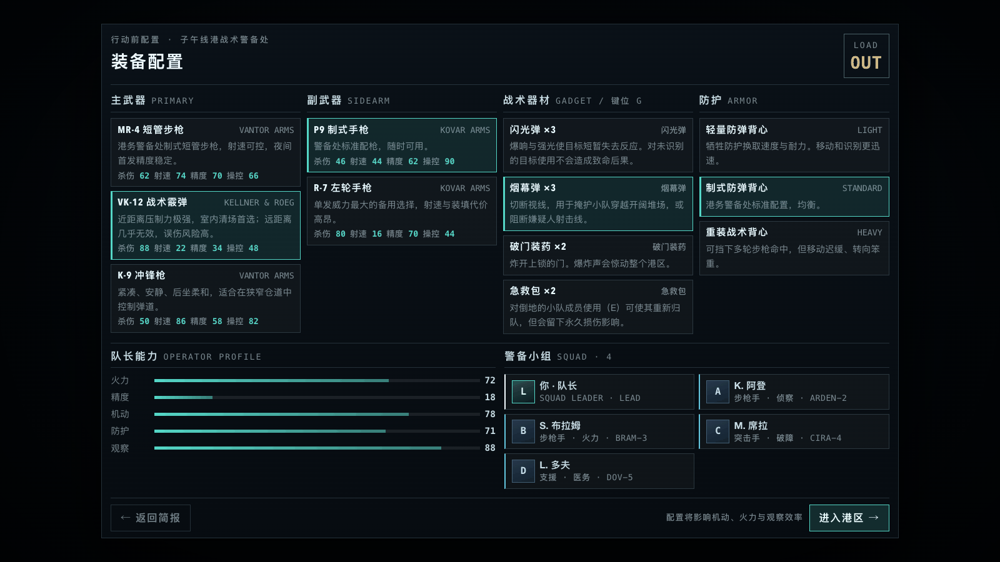
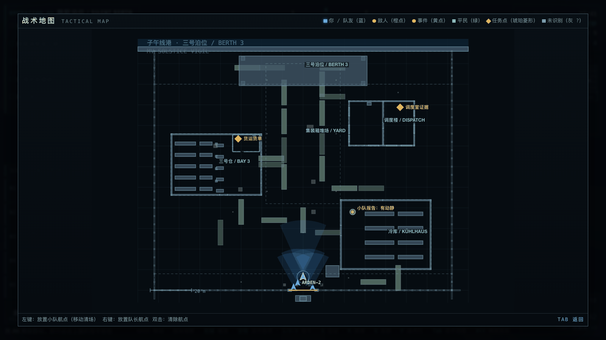
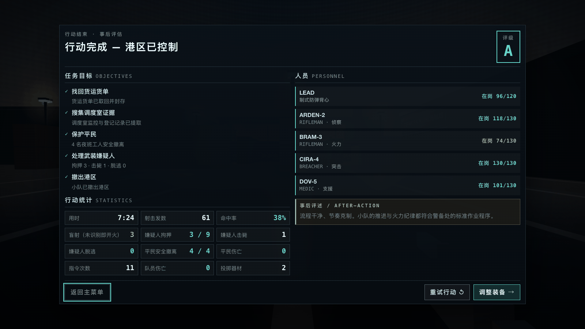

# 寂静子午线 · THE SILENT MERIDIAN

> 战术警备模拟 · 行动 01「静默泊位」
> 23:41，海雾封锁子午线港三号泊位。你带领一支四人警备小组进入仓区，
> 处理武装嫌疑人、保护平民、找回货单、搜集调度室证据。
> **先观察，再下令。**

[](https://sun-sh902.github.io/silent-meridian/)
[](#自检)
[](LICENSE)
[](#threejs-只有一份运行时)

纯前端、离线可跑的第一人称战术模拟：**零运行时依赖**（Three.js 已本地内联），
不请求任何网络资源，全部贴图与音效由 canvas / WebAudio 现场程序化生成。
一条命令跑完 11 套真实 Chrome 验收测试。

[在线试玩](https://sun-sh902.github.io/silent-meridian/) ·
[本地启动](#启动方式重要) ·
[操作说明](#操作) ·
[自检](#自检)



<details>
<summary><b>更多截图</b>（主菜单 / 简报 / 配装 / 战术地图 / 战果）</summary>

| 主菜单 | 行动简报 |
| --- | --- |
|  |  |

| 装备配置 | 战术地图（Tab） |
| --- | --- |
|  |  |



全部截图由 `node tools/readme-shots.mjs` 真实运行游戏后自动拍摄，非手绘示意图。

</details>

### 这是什么

一个**可完成的任务关卡**，而不是技术演示：进入港区、观察识别、下达小队指令、
拘押嫌疑人、护送平民、取回情报并撤出，最后给出评级与逐项统计。

几条把它和其他练手项目区分开的约束：

| 约束 | 落地方式 |
| --- | --- |
| 离线可跑 | 无 `fetch` / `Worker` / 动态 `import()` / CDN；Three.js 本地内联 |
| 视觉资产零外部文件 | 贴图、标识、天空、水面全部程序化生成（`src/textures.js`） |
| 音频零外部文件 | WebAudio 合成枪声、回声、耳鸣（`src/audio.js`） |
| 可验证 | 11 套 puppeteer 套件跑真实 Chrome，页面异常计入失败 |
| 手感可回归 | 参数集中在 `src/feel.js`，基线对比能测出行为漂移 |

---

## 启动方式（重要）

### 方式 A：本地服务器（推荐，`index.html` 的完整开发模式）

`index.html` 与 `src/*.js` 是 **ES module**。浏览器在 `file://` 下会以 CORS 策略
拦截整张模块图（`Access to script at 'file://…/src/main.js' from origin 'null'
has been blocked by CORS policy`），**一行 JS 都不会执行**，于是页面有样式但所有按钮都点不动。
因此必须通过 HTTP 打开：

```bash
git clone https://github.com/Sun-sh902/silent-meridian.git
cd silent-meridian
npm start                  # 起本地服务并打印地址，零依赖（只用 Node 内置模块）
```

等价的手工方式（不想装 Node 也行）：

```bash
python3 -m http.server 8123
```

> macOS 上也可以直接双击 `start.command`，它会切到自身所在目录再起服务。

然后访问：

```
http://localhost:8123/
```

（端口可换：`npm start -- --port 9000`，或命令里改，地址跟着改。）

### 方式 B：不用服务器，直接双击

双击这两个文件中的任意一个，都不需要本地服务，`file://` 下可正常运行：

| 文件 | 说明 |
| --- | --- |
| `dist/silent-meridian.html` | 单文件构建：JS / CSS / 贴图全部内联，只有一个文件 |
| `index.html` | 会自动检测 `file://` 并改加载 `dist/silent-meridian.js`（**经典脚本**，不受模块 CORS 限制） |

> 方式 B 依赖 `dist/` 已经存在且**不是陈旧的**。若你改过 `src/` 或 `dist/` 被删掉，先执行一次
> `node build.mjs` 重新生成。若 `dist/silent-meridian.js` 缺失，页面会弹出提示直接告诉你这条命令。
>
> ⚠️ **改完 `src/` 一定要重新构建再验证方式 B。** 陈旧包和新鲜包的版本号是一样的，肉眼分辨不出来；
> `npm test` 会先跑 `tools/check-dist.mjs` 用内容哈希把它揪出来（见下文「自检」）。

> 本仓库**直接提交了 `dist/`**（约 1.4 MB）：clone 下来就能双击开玩，不必先装依赖再构建。
> 代价是改了 `src/` 必须重新构建并提交，否则仓库里的包会过期 ——
> `npm test` 的第一项 `check-dist` 就是用内容哈希专治这个（见下文「自检」）。

### 重新打包

```bash
node build.mjs
# → dist/silent-meridian.js   （经典脚本，file:// 可加载；头部带 vX.Y.Z + 内容哈希标记）
# → dist/silent-meridian.html （单文件）
# → dist/build-stamp.json     （本次构建的输入指纹，供 check-dist 判定陈旧）
```

### 为什么会有两种加载方式

| 打开方式 | 加载的东西 | 能否运行 |
| --- | --- | --- |
| `http://localhost:8123/` | `src/main.js`（`type="module"` + import map + 19 个源文件共 51 条 `import`） | ✅ |
| `file:///…/index.html` | 引导脚本检测到 `file:`，改加载 `dist/silent-meridian.js`（IIFE 经典脚本） | ✅ |
| `file:///…/index.html`（缺 dist） | 加载失败 → 页面弹出命令提示 + 调试面板标红 | ⚠️ 有明确提示，不再是“静默无反应” |

代码里没有任何 `fetch` / `Worker` / 动态 `import()` / 网络资源，贴图全部由 canvas 现场生成，
所以打包成经典脚本后可以在 `file://` 下完整运行。

---

## 调试面板（判断脚本到底跑没跑）

按 **`D`** 唤出（主菜单 / 简报 / 配装 / 战果 / **暂停菜单**）；**行动中 `D` 属于游戏（右平移）**，此时请按 **`~`**（反引号）开关面板。
面板固定显示：

* **脚本已执行** —— 引导脚本执行时间（引导脚本是内联经典脚本，永远会跑）
* **打开方式** —— `http:` / `file:` 与实际采用的加载器
* **主脚本** —— ✓ 已加载 / ✗ 加载失败
* **动作处理器** —— ✓ 已注册（列出全部动作）/ ✗ 未注册（说明游戏脚本没运行）
* **页面按钮** —— 当前 DOM 里 `[data-action]` 的数量
* **指针锁定** —— 锁定时点按钮需先按 `Alt`
* **最近一次点击事件** —— 时间 / 标签 / 动作名，用来确认点击是否真的送达

---

## 操作

| 键位 | 作用 |
| --- | --- |
| `W` `A` `S` `D` | 移动 |
| `Shift` / `Ctrl` | 疾行 / 潜行 |
| 鼠标 | 环视（点击画面锁定指针） |
| 右键 | 举枪瞄准（观察效率提升，散布减小） |
| 左键 | 射击 |
| `R` | 换弹 |
| `G` | 投掷战术器材（按住蓄力） |
| `F` | 战术灯开关（照得远，但也更容易被发现） |
| `E` | 互动：取回物品 / 护送平民 / 拘押嫌疑人 / 急救队员 |
| 空格（按住） | 战术暂停：时间减慢至 10%，用于观察与下令 |
| `1` | 编队跟随 FOLLOW |
| `2` | 原地待命 HOLD |
| `3` | 移动清场 CLEAR（推进至准星落点） |
| `4` | 归队 REGROUP |
| `Tab` | 战术地图（左键放置小队航点 / 右键放置注意力标记） |
| `Alt` | 释放鼠标（光标模式）：可点击 HUD 指令按钮；点击画面恢复视角 |
| `Esc` | 暂停菜单 |
| `M` | 静音 |

> 界面会随窗口尺寸与浏览器缩放自动重排，不会挤压重叠；按 `D` 可唤出调试面板查看当前视口信息
> （仅限主菜单 / 简报 / 配装 / 战果 / 暂停菜单；**行动中 `D` 是右平移**，此时请按 `~`）。
> 调试面板里的「构建标记」一栏会显示当前包的版本与内容哈希，版本与页面不符时会标红。

---

## 手感参数中枢与调参面板（第 1 批）

所有手感数字集中在 **`src/feel.js`**，逻辑代码逐帧读取该对象，不在构造期缓存 —— 改一个数立即生效。

| 分组 | 内容 |
| --- | --- |
| `move` | 走/跑/蹲/举枪四档速度、耐力、加速/减速/滑行时长、斜向归一化、转向阻尼 |
| `jump` | 跳跃参数（本轮**全禁用**，值全为 0；已预留 `onLanding` 接口位） |
| `camera` | 默认/疾跑/ADS 视场角、灵敏度与 ADS 灵敏度倍率、头部晃动幅度与**开关**、相机侧倾 |
| `weapon` | 后坐上跳、回落速度、水平抖动、后坐→瞄准转化速率、规律弹道表开关 |
| `spread` | 基础/移动/疾跑/连发扩散、扩散收缩速度、后坐与压制对扩散的贡献 |
| `feedback` | hitmarker 时长、受击顿帧、伤害数字、屏幕震动强度与衰减、枪口闪光时长、弹壳抛出速度 |
| `reload` | 切枪时长、ADS 进出速率、换弹时长缩放、换弹可打断 |
| `viewmodel` | 第一人称武器的起伏/拖曳/后挫（惯性载体，按约定准星保持 1:1 无延迟） |

> `data.js` 里的 `TUNING`（AI/识别参数）**按约定保持原样未动**，不属于本文件。

### 调参面板

| 键 | 作用 |
| --- | --- |
| `P` | 完整面板：底部抽屉式（保留上方约 1/3 画面），**释放指针、时间保持 100%、WASD 仍可移动** |
| `O` | 只读悬浮层：**不释放指针**，显示四条实时曲线与数值 |
| `[` `]` | 悬浮模式下 减小 / 增大 当前选中参数 |
| `,` `.` | 悬浮模式下 切换选中参数 |

面板内提供：**导出 JSON** + **一键复制**、**3 个预设槽**（槽 A 固定为「原始（改动前）」用于 A/B 对比）、
**冻结敌人 AI**、**无敌**、**头部晃动开关**、**重置曲线**。
标有 `未接线` 徽标的参数属于第 2/3 批实现，当前拖动不改变行为（避免误导）。

四条曲线来自 `feel.js` 的 `telemetry` 环形缓冲（预分配，零 GC）：速度、加速度、后坐、扩散。

### 手感回归基线（证明第 1 批零行为变化）

```bash
node tools/feel-baseline.mjs compare tools/feel-baseline.json
```

以 **1/60s 固定步长**驱动 `game.advance()`（`?test=1` 冻结 rAF），屏蔽帧率抖动与渲染差异，
因此结果逐位可复现。比对项覆盖：四档稳态速度与 FOV、起步/松手斜坡、相机侧倾与头部起伏、
连发扩散首末值、后坐逐发累积与回落、换弹/切枪/ADS 时长、震动包络、枪口闪光时长。

> 基线运行需在同一台机器上；不同 GPU/浏览器版本不影响该脚本（它只跑模拟，不依赖渲染）。

### 已修复：射速翻倍与致盲时长砍半

`player.update()` 先调用 `updateCommon(dt)`（其中已有一次 `fireCd -= dt`），随后又单独减了一次，
使 `fireCd` 每帧递减 2×dt：

* 标称 640rpm 的 MR-4 实测每 3 帧一发（≈1200rpm）—— **已修**，现为每 6 帧一发；
* 同一个 bug 还让 `blind` 也被递减两次，闪光弹致盲时长被砍半（2.5~7s 只剩 1.25~3.5s）—— **已修**。

修复后基线改用新值：`spread.shots` 从 30 变为 **15**（90 帧 @1/60s 固定步长）。
理论值 16 发（1.5s × 640rpm ÷ 60）；实测 15 发是因为射击间隔被量化到整帧：
640rpm ⇒ 5.625 帧，向上取整为 6 帧 ⇒ 有效射速 600rpm。
这是逐帧递减的固有量化误差，且**随刷新率变化**（144Hz 下为 617rpm）。
若要精确对齐标称射速，应把 `this.fireCd = rate` 改成把余量结转的 `this.fireCd += rate`，
属于独立议题，尚未改动。

> 改动 `feel.js` 或任何影响手感的代码后，记得重新采样基线：
> `node tools/feel-baseline.mjs capture tools/feel-baseline.json`

## 响应式与缩放

* **字体**：统一走 `--fs-*` 令牌，全部写成 `max(Nrem, 12px)`，**任何情况下不小于 12px**。
* **尺寸**：宽高用 `clamp()` / `rem` / `vmin`，间距用 `--pad-*`；根字号 `clamp(15px,…,18px)` 随视口温和缩放。
* **布局**：HUD 是 `grid`（三行 × 三列），所有面板参与布局并靠断点重排；
  只有「全屏特效层」和「准星集群」保留绝对定位 —— 后者必须锁定视口正中才能与瞄准射线一致。
* **断点**：`≥1920` / `≤1439` / `≤1023` / `≤767` / `≤480`，另有 `≤760px`、`≤620px`、`≤520px`、`≤440px` 的**矮窗口压缩档**。
  窄屏下优先隐藏次要元素（小地图、无线电、提示条、罗盘）而不是压缩文字。
* **Canvas**：用 `ResizeObserver` 监听容器、`matchMedia('(resolution: Ndppx)')` 监听 DPR 变化，
  backing store 恒等于 `CSS 尺寸 × devicePixelRatio`（上限 2），浏览器缩放后不模糊、不变形。
* **防溢出**：`html/body/#app/#hud` 全部 `overflow:hidden`，不产生横向滚动条。

### 响应式验收测试

```bash
node tools/responsive-test.mjs
```

分四段扫描，共 **38 项审计**：

* A 段：8 档宽度（1920 / 1440 / 1280 / 1024 / 900 / 768 / 600 / 480）
* B 段：5 档浏览器缩放（50% / 75% / 100% / 125% / 150%，物理窗口 1440×900）
* C 段：4 个界面（标题 / 简报 / 配装 / 说明）× 5 档宽度
* D 段：战果面板 × 5 档宽度

逐项断言：
无横向滚动条、关键面板两两不重叠、文字不溢出/不被裁切、字号 ≥ 12px、
canvas 的 backing store 与 `CSS 尺寸 × DPR` 一致且宽高比不变。

> **为什么需要 Alt？** 行动中浏览器处于指针锁定状态，所有鼠标点击都会被投递给 3D 画面，
> HUD 上的按钮收不到点击。按 `Alt` 释放指针后即可用鼠标正常点击指令按钮，
> 此时时间降速到 30% 供你从容操作；点击画面任意位置即可回到鼠标视角。
> 指令按钮的键盘快捷键 `1` `2` `3` `4` 在任何状态下都可用。

---

## 核心机制

### 友军伤害与目标识别

* **友军伤害已关闭**：主角与四名队友同属蓝方，子弹会**直接穿过**友军而不产生伤害
  （伤害入口另有一层兜底拦截）。穿过队友后依然能命中后方的敌人。
* **平民仍会被误伤** —— 这是任务失败条件，交战规则没有被削弱。
* 准星对准队友时，目标卡显示其**呼号与专长**，而不是 `UNKNOWN CONTACT`。

### 战术地图配色

| 标记 | 含义 |
| --- | --- |
| 🔵 蓝色箭头 | 主角与队友（主角带白色描边便于辨认） |
| 🟠 橙色圆点 | 已识别的敌人（投降/被拘押显示为空心圈） |
| 🟡 黄色圆点 | 事件：枪声 / 警讯 / 爆炸 / 情报回收 / 伤亡 / 发现平民 |
| 🟢 绿色方块 | 平民 |
| 🔶 琥珀菱形 | 任务点 |
| ⚪ 灰色 `?` | 未识别接触（保留「先观察再下令」的核心机制） |

事件点保留约 2 分钟后淡出，最近 15 秒内会显示文字标签。

### 两张地图的坐标约定（已修正）

| | 小地图 `#minimap` | 战术地图 `#tacmap-canvas` |
| --- | --- | --- |
| 模式 | **玩家朝向朝上**（随转向旋转） | **北朝上固定**（世界固定） |
| 变换 | 平移(−玩家) → 绕玩家旋转 **+yaw** → 缩放 k → 平移到画布中心 | 平移(−bounds) → 等比缩放 → 居中平移 |
| 旋转中心 | **玩家自身位置**（不是画布原点） | 不旋转 |
| 角度 | 全部弧度；每帧由绝对 `p.yaw` 重算，无累加器 | 同上 |

> ⚠️ **本项目 yaw 的符号约定**：`player.look()` 里是 `yaw -= dx * sens`，
> 所以**鼠标右转 → yaw 减小**，左转 → yaw 增大。这与「yaw 增加 = 右转」的直觉相反，
> 修改地图朝向相关代码时务必注意。

### `window.__mapDebug` 调试接口

```js
__mapDebug.mode              // 'minimap=player-up(rotating) / tacmap=north-up(fixed)'
__mapDebug.player            // { x, y, yaw }   ← y 即世界坐标的 z
__mapDebug.yawRad / yawDeg   // 当前朝向
__mapDebug.buildings         // [{ name, x, y }]
__mapDebug.worldToMap(x, z)  // 世界 → 小地图像素（也接受 {x,z}，旋转、玩家朝上）
__mapDebug.worldToMapTac(x, z) // 世界 → 战术地图像素（北朝上）
__mapDebug.mapToWorld(mx, my)  // 小地图像素 → 世界
__mapDebug.labels / labelsMini // { stats:{total,drawn,rejected,offscreen}, items:[…] }
```

### 地图标签规则

* 文字**始终水平**绘制，不参与旋转；随旋转的是锚点，不是字形。
* 字号固定为设计像素，因 `render()` 已 `setTransform(dpr,…)`，HiDPI 下不缩水、不被地图缩放拉伸。
* **碰撞避让**：候选标签按「优先级 + 与玩家距离」排序后逐个占位，重叠者直接隐藏（`stats.rejected` 可查）。
* 超出可视范围直接跳过；面积大、距离近的优先。
* 一律加深色半透明底衬，保证亮/暗背景下都可读。

### 先观察，再下令

海雾中无法从轮廓分辨平民与持械者。把准星压在目标上，屏幕中央会出现目标卡与
识别进度条：

* `UNKNOWN CONTACT` — 只知道那里有活动；
* `人员接触 · 身份不明` — 已发现，未确认；
* `武装嫌疑人` / `平民 · 非战斗人员` — 识别完成。

识别完成前开火会记为「盲射」，直接扣减行动评分；误伤平民则立即判定行动失败。
按住空格进入战术暂停，可以在不冒风险的情况下完成识别并下达指令。

### 三条小队指令

* 编队跟随 — 四人按楔形队形随队长推进，自动绕开障碍。
* 原地待命 — 小队停下并看守当前朝向；朝向取自下令瞬间队长的视线方向。
* 移动清场 — 小队分成两个小组交替掩护（bounding overwatch）推进至航点，
  一组跃进时另一组停下掩护。

小队默认遵守火力纪律：只有收到「移动清场」、或遭遇射击后才会开火，其余情况只做报告。
直接看向某名队员时下令，指令只会下给该队员。

### 战术地图（Tab）

俯视港区平面图，显示小队、已识别目标、任务点与最后一次目击位置。
地图上左键放置航点即下达「移动清场」，右键放置注意力标记，双击清除。

---

## 任务目标

| 目标 | 说明 |
| --- | --- |
| 找回货运货单 | 三号仓（BAY 3）办公室内的文件 |
| 搜集调度室证据 | 港区调度楼内的监控与登记记录 |
| 保护平民 | 找到夜班工人并护送（`E`）至南门集结点 |
| 处理武装嫌疑人（次要） | 拘押优于击毙：劝降后靠近按 `E` 拘押 |
| 撤出港区 | 三项主要目标完成后，南门装甲车开放 |

---

## 工程结构

```
index.html            页面骨架与全部界面 DOM
styles/ui.css         界面样式（HUD / 简报 / 配装 / 地图 / 战果）
src/main.js           引导与调试参数
src/game.js           任务编排：指令系统、识别、目标流程、主循环
src/world.js          原创港区布局、光照、海雾、环境贴图
src/actors.js         人物模型、小队 / 嫌疑人 / 平民 AI
src/player.js         队长控制器
src/combat.js         弹道、命中、投掷物、特效
src/nav.js            导航网格与 A* 寻路
src/geom.js           数学、空间网格、视线、碰撞
src/viewmodel.js      第一人称武器与姿态
src/hud.js            平视显示
src/tacmap.js         战术地图
src/screens.js        主菜单 / 简报 / 配装 / 战果面板
src/textures.js       程序化贴图与虚构标识
src/audio.js          WebAudio 程序化音效
src/feel.js           手感参数中枢（唯一真源）+ 实时遥测环形缓冲
src/tuning.js         调参面板（P / O 唤出）
src/canvasfit.js      canvas 尺寸与 DPR 适配（ResizeObserver + matchMedia）
src/maplabel.js       地图标签避让（对象池 + 宽度缓存）
vendor/three.module.js  Three.js 运行时（本地内联，离线可用）
vendor/three.core.js    Three.js 运行时核心（被上一行 import）
tools/                11 套 puppeteer 验收套件 + 性能/手感基线 + 截图脚本
docs/shots/           README 截图（由 tools/readme-shots.mjs 生成）
dist/                 构建产物（已提交：双击即玩）
```

### 技术栈

没有框架，没有打包器以外的工具链，没有 CI 服务依赖：

| 层 | 用什么 | 说明 |
| --- | --- | --- |
| 渲染 | Three.js `0.180.0`（本地 vendored） | 唯一运行时依赖；`src/` 7 个文件裸导入 `three` |
| 界面 | 原生 DOM + 一份 `styles/ui.css` | 无框架、无虚拟 DOM；HUD 更新做过逐帧开销优化 |
| 逻辑 | 原生 ES module | 19 个源文件、51 条 `import`，浏览器直接跑，无编译步骤 |
| 资产 | 无 | 贴图/音效全部程序化生成，仓库里没有一个美术资源文件 |
| 构建 | esbuild（仅 devDependency） | 只用于产出 `file://` 可用的 `dist/*` |
| 测试 | puppeteer-core + 本机 Chrome | 11 套件；页面异常、`console.error`、资源失败一律判 FAIL |

### Three.js 只有一份运行时

`src/` 里 7 个文件都用裸标识符 `import ... from 'three'`，它有两套解析路径：

| 路径 | 解析到 | 用在哪 |
| --- | --- | --- |
| 开发（http） | `index.html` 的 import map → `vendor/three.module.js` | `npm run dev` 式浏览 |
| 打包（file://） | esbuild `--alias:three=./vendor/three.module.js` | `dist/*` |

`build.mjs` 显式加了 alias，把打包路径也钉到 `vendor/`，**两份拷贝因此不可能分叉**。
`package.json` 里的 `three` 也固定为精确版本 `0.180.0`（原来是 `^0.180.0`），
仅供编辑器/工具链解析类型，不参与打包。

## 调试参数

在地址后追加查询参数便于验证：

`?deploy=1` 直接进入行动 · `&pos=x,z` 指定出生点 · `&yaw=弧度` 指定朝向
`&alarm=1` 立即触发警讯 · `&dummy=8` 在正前方放置静止目标
`&tacmap=1` 打开战术地图 · `&screen=briefing|loadout` 打开指定界面
`&debrief=1` 查看样例战果面板 · `&novm=1` 隐藏第一人称武器

## 自检

### 一条命令跑完全部验收

```bash
npm test            # = node tools/run-all.mjs，11 个套件，逐套件汇总退出码
```

套件一览（`npm run test:<名字>` 可单独跑）：

| 套件 | 作用 |
| --- | --- |
| `test:dist` | dist/ 陈旧检测（内容哈希，不需要浏览器） |
| `test:click` | 三种打开方式下的全界面点击链路 |
| `test:fixes` | 备战静音 / 目标卡 / 友军伤害 / 地图配色 |
| `test:p0` | 四个 P0 缺陷的复现与回归（含 `?deploy=1&test=1` 固定步长驱动） |
| `test:p1` | 射速与致盲时长、斜向速度、AI 掩体死循环、帧率无关性、任务定时器、识别时间基准、AI 点射 |
| `test:map` | 小地图 / 战术地图坐标与标记 |
| `test:tuning` | 调参面板：滑块与 `FEEL_SCHEMA` 逐项对账、导出/复制路径 |
| `test:responsive` | 8 档宽度 × 5 档缩放 × 各界面布局审计 |
| `test:audio` | 20 次闪光弹压力测试与控制组对比 |
| `test:feel` | 手感基线逐位比对 |
| `test:selftest` | 注入未捕获异常，自证测试骨架真的会变红 |

### dist/ 陈旧检测（不需要浏览器，秒级）

```bash
node tools/check-dist.mjs
```

`dist/` 被 `.gitignore` 忽略，而 `index.html` 在 `file://` 下加载的正是 `dist/silent-meridian.js`。
**改完 `src/` 忘记重新构建时，双击运行的人会继续跑旧包，而旧包与新鲜包的版本号完全相同，从外部看不出任何差别。**
本脚本用输入文件的内容哈希（`src/**/*.js`、`index.html`、`styles/ui.css`，记录在 `dist/build-stamp.json`）
与当前值逐项比对，任何一个文件在构建后被改动都会判 FAIL 并列出文件名：

```
[FAIL] dist 不是陈旧的（src / index.html / ui.css 未在构建后被改动）
       — 已改动: src/game.js —— 请执行： node build.mjs
```

用内容哈希而不是 mtime，因此不受 `git clone` / 检出顺序影响。
运行时另有一层兜底：调试面板的「构建标记」会显示包内嵌的版本与哈希，
与页面版本不一致时标红（同版本下的内容陈旧运行时无法判断，由本脚本负责）。

### 性能与资源探测（可比较的量化基线）

```bash
npm run perf                              # 打印当前指标
npm run perf:save                         # 存为 tools/perf-baseline.json
npm run perf:diff                         # 与基准比较，明显变差则退出码非 0
```

输出每帧 DOM 变更数、布局读取次数、逻辑耗时，以及反复部署时的 GPU 资源增量。
它**不是**通过/失败型测试，而是一把尺子 —— 用来证明优化真的有效，而不是凭感觉。

判定每项时会带上「哪个方向更好」：FBO 删除数是越多越好，其余越少越好；
逻辑耗时在 swiftshader 下采样帧数少、噪声大，因此只作参考、不计入失败。
部署增量用「相邻两次部署的差值」衡量稳态泄漏，避免把首次部署的一次性初始化误算成每次泄漏。

### 逻辑吞吐基准（低方差，适合 A/B）

```bash
npm run bench                             # 打印结果
npm run bench:save                        # 存为 tools/perf-bench.json
npm run bench:diff                        # 与基准比较，明显变差则退出码非 0
```

`perf-probe` 量的是「稳态成本」，`perf-bench` 量的是「纯逻辑吞吐 + draw call」。
后者用 `?test=1` 冻结 rAF、以固定步长手动驱动 `advance()`，因此几乎不受软件光栅化
噪声影响 —— 这是能做出可信 A/B 对比的关键。每个场景跑 7 轮取中位数。

> 两个容易踩的坑（工具里已处理并注释）：
> 1. `Game.loop()` 每帧调用**两次** `renderer.render()`（主场景 + viewmodel 私有场景），
>    而 `info.autoReset` 为 true —— 第二次会把计数清零，直接读 `info.render.calls`
>    得到的是「武器」的十几个 draw call，完全测不到关卡。必须包一层 render，
>    只在主场景那次之后取样。
> 2. 逻辑基准会把演员传送到 999（远超 `far=420`），若紧接着测渲染，
>    整个场景都被视锥裁掉，只能得到空场景的数字。必须先重新部署再扫描视角。

> 本项目 P2/P3 轮的实测结果（同一台机器，HEAD 前后对比，900 步固定步长取 7 轮中位数）：
>
> 方法：基准与优化**交错各跑两遍**、各取最优，以抵消机器漂移。
> 加固前同代码跨进程重跑有约 ±15% 抖动，加「预热一轮 + 取 9 轮最小值」后收敛到约 ±5%。
>
> | 场景 | 优化前 | 优化后 | 变化 |
> | --- | --- | --- | --- |
> | 逻辑 idle-follow | 118.3 ms | **28.6 ms** | **-75.8%** |
> | 逻辑 clear-order | 121.5 ms | **30.6 ms** | **-74.8%** |
> | 逻辑 engage-9（9 人交火） | 141.3 ms | **52.2 ms** | **-63.1%** |
> | 逻辑 squad-firing | 118.0 ms | **35.8 ms** | **-69.7%** |
> | **其中 HUD 单独计时** | **100.7 ms** | **21.2 ms** | **-78.9%** |
> | 主场景 draw call（中位） | 119 | **98** | -17.6% |
> | 主场景 draw call（峰值） | 275 | **254** | -7.6% |
> | geometries | 492 | **425** | -13.6% |
> | triangles（中位） | 11992 | 12996 | +8.4%（与 draw call 权衡，仅参考） |
>
> 其中约 8~10 个百分点来自**移除雨幕**：5200 条雨丝粒子与自写着色器、
> 整整一层全屏 CSS 雨幕合成层、以及闪电环境光都不再需要。
> | 每帧 DOM 变更（perf-probe） | 27.3 | **2.6** | -90% |
> | 每帧布局读取（perf-probe） | 55.2 | **3** | -95% |
> | 每次重新部署的纹理净增 | +8 | **0** | 10 次部署恒为 37 张 |
> | 每次重新部署的 geometry 净增 | +24.6 | **0** | 398~423 波动，无增长趋势 |
>
> **归因**：优化前 `hud-update-only`（100.7ms）占了 `idle-follow`（118.3ms）的约 **85%** ——
> 每帧的 HUD DOM/布局开销是当时最大的一笔逻辑成本。这一项被压到 21.2ms 后，
> 剩下的约 7ms 才是真正的游戏逻辑。
>
> **三角形数上升是有意接受**：把 46 个水洼合并成 1 个网格后失去逐对象视锥裁剪，
> 最多 644 个三角形每帧都提交；换来的是最多 46 次透明 draw call 降到 1 次。
> draw call 是稀缺资源（每次都有状态校验与 uniform 上传开销），
> 而每帧几百个三角形对任何 GPU 都可以忽略。

### 点击链路自检

用真实 Chrome（非预览面板）跑一遍所有界面按钮的点击链路，覆盖三种打开方式：

* `http://localhost` 服务器模式
* `file://` 直接打开 `dist/silent-meridian.html`（单文件）
* `file://` 直接打开 `index.html`（自动降级到经典脚本）

```bash
node build.mjs && node tools/click-test.mjs
```

逐项校验：菜单导航、配装点选、部署、HUD 指令按钮、战术地图落点、暂停/继续/中止、
调试面板内容，并用 `elementFromPoint` 检查按钮是否真的命中自身（被遮挡直接判 FAIL）。

> Chrome 可执行文件不再硬编码：优先取环境变量 `CHROME_PATH`，否则在 macOS / Linux / Windows
> 的常见路径中依次探测；全部找不到时以退出码 2 结束并打印已尝试的路径（不会抛栈）。
> 页面未捕获异常、`console.error`、资源加载失败一律计入失败并影响退出码 ——
> `tools/selftest-red.mjs` 会「注入一个未捕获异常」自证这条链路真的会让测试变红。

### 音频 / 闪光弹压力测试

```bash
node tools/audio-stress.mjs
```

连续触发 20 次闪光弹，并与"什么都不投掷"的对照组比较，校验：

* 引爆次数**恰好 20**（防止"每帧重复引爆"这类缺陷回归）
* 主线程单帧逻辑耗时（不含渲染）平均 < 16ms、峰值 < 50ms
* `AudioContext` 数量恒为 1，音频节点用完后回落
* 投掷物 / DOM 日志 / 白屏层全部回收，无未捕获异常

### README 截图

```bash
node tools/readme-shots.mjs        # → docs/shots/*.png（会用本机 Chrome 真跑一遍界面）
```

按用户路径依次驱动主菜单 → 简报 → 配装 → 部署 → 战术地图 → 战果并逐屏截图；
每步都断言目标界面确实显示了，界面没出现就以非零退出码失败（避免拍出「空白截图」还当成功）。
它**不在 `npm test` 里**：这是人工流程，不该在每次回归时重写仓库文件。

---

## 音频实现约束（为什么不会再卡死/爆音）

| 约束 | 实现位置 |
| --- | --- |
| 全局唯一 `AudioContext`（模块级单例，绝不 new 第二个） | `src/audio.js` `acquireContext()` |
| 每个 voice `stop()` 后在 `onended` 里 `disconnect()` 并释放引用 | `src/audio.js` `_v()` |
| 同时在发声的 voice 上限 40，超限丢弃，避免雪崩 | `src/audio.js` `_budget()` |
| 同名音效最小间隔（闪光弹 150ms），防止叠加成啸叫 | `src/audio.js` `_gate()` |
| 白噪声缓冲：只生成一次 + 16384 采样分块异步生成 | `src/audio.js` `_buildNoiseBuffer()` |
| 所有增益变化 ≥5ms ramp，禁止瞬时赋值（含静音） | `src/audio.js` `_env()` / `setMuted()` |
| 输出链末端 `DynamicsCompressor` 限幅 + 输出增益 0.8 | `src/audio.js` `init()` |
| 耳鸣音 2.2kHz + 低通柔化 + 音量 0.028（戴耳机不刺耳） | `src/audio.js` `flashbang()` |
| 致盲白屏只用 CSS opacity 过渡，零逐像素操作 | `src/hud.js` `flash()` |

---

## 开源与部署

* **许可证**：[MIT](LICENSE) —— 可自由使用、修改、分发、商用，保留版权声明即可。
* **在线试玩**：GitHub Pages 直接以仓库根目录为站点（`index.html` 是入口，
  `src/` 按 ES module 正常加载，无需任何构建步骤）。
* **纯静态**：整站没有一个后端接口，可以整包丢到任意静态托管（Vercel / Netlify / Cloudflare
  Pages / 对象存储）上；`dist/silent-meridian.html` 单文件版尤其适合直接分发。
* **想改代码**：`npm install` → 起本地服务 → 改 `src/` → `npm test` → `node build.mjs`。
  改了行为就顺手补一条断言，`tools/` 里的套件是照着「页面异常也算失败」写的。

### 参与与反馈

Issue / PR 都欢迎。提交前请确保 `npm test` 11/11 通过，并且在 `src/` 有改动时
重新执行过 `node build.mjs`（否则 `check-dist` 会红）。

---

本作中的港区、机构、品牌、船名与人员均为虚构创作，与任何现实企业、机构或个人无关。
